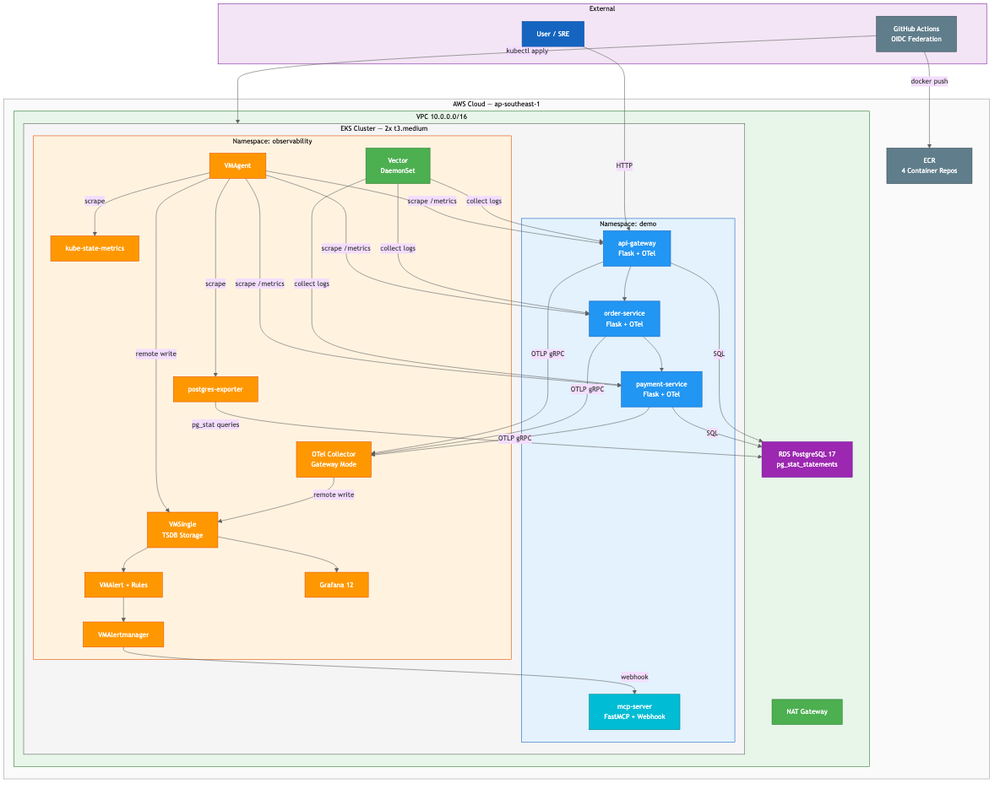
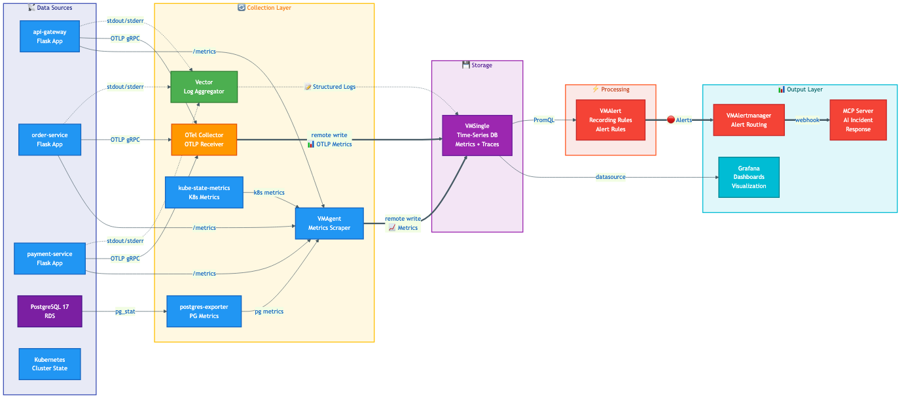
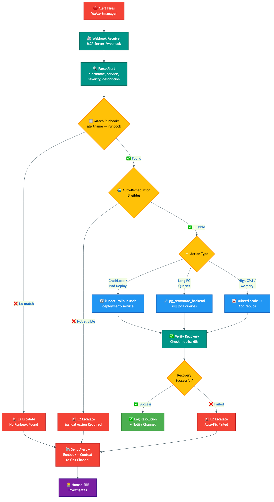

# SRE EKS Observability Platform

Full-stack SRE observability demo on AWS EKS showcasing **Pulumi IaC**, **VictoriaMetrics**, **OpenTelemetry**, **Vector**, **PostgreSQL tuning**, and **AI-driven incident remediation**.



## Stack

| Layer | Technology |
|-------|-----------|
| **IaC** | Pulumi (Python) — ComponentResource pattern, VPC, EKS, RDS, ECR, IAM OIDC |
| **Metrics** | VictoriaMetrics (VMSingle + VMAgent + VMAlert + VMAlertmanager) |
| **Traces** | OpenTelemetry Collector (gateway mode, OTLP → prometheusremotewrite) |
| **Logs** | Vector (DaemonSet, kubernetes_logs → JSON parse → console) |
| **Database** | PostgreSQL 17 on RDS with pg_stat_statements, custom parameter tuning |
| **Monitoring** | postgres_exporter (custom queries), kube-state-metrics |
| **Visualization** | Grafana 12 with 3 provisioned dashboards |
| **AI Remediation** | FastMCP server with 7 tools + webhook receiver (L1/L2 decision) |
| **Apps** | 3 Python Flask microservices with OTel SDK + Prometheus metrics |
| **CI/CD** | GitHub Actions with OIDC federation, Trivy scanning |

## Architecture

### Observability Data Flow



### AI Incident Response (L1/L2)



**L1 Auto-remediation** (runbook-matched):
- `PodCrashLooping` → `kubectl rollout undo`
- `PostgreSQLConnectionsNearLimit` → `pg_terminate_backend` idle connections
- High resource usage → `kubectl scale` replicas

**L2 Escalation** (requires human judgment):
- SLO burn rate alerts → webhook to Slack/Discord with runbook link
- High latency → manual investigation
- Error spike → root cause analysis needed

## Quick Start

### Prerequisites

- AWS CLI configured (`aws sts get-caller-identity`)
- Pulumi CLI (`brew install pulumi/tap/pulumi`)
- Docker Desktop with buildx
- kubectl, helm
- Python 3.12+

### Deploy

```bash
# 1. Infrastructure (~20 min)
cd infra
python3 -m venv venv && source venv/bin/activate
pip install -r requirements.txt
pulumi login --local
PULUMI_CONFIG_PASSPHRASE="your-passphrase" pulumi stack init dev
PULUMI_CONFIG_PASSPHRASE="your-passphrase" pulumi config set --secret db-password "YourPassword!"
PULUMI_CONFIG_PASSPHRASE="your-passphrase" pulumi up --yes

# 2. Observability stack (~5 min)
./scripts/setup.sh

# 3. Build and push images
./scripts/build-push.sh

# 4. Deploy applications
kubectl apply -k k8s/overlays/production/

# 5. Access services
./scripts/port-forward.sh
# Grafana:         http://localhost:3000  (admin/admin)
# VictoriaMetrics: http://localhost:8429
# API Gateway:     http://localhost:8080
```

For the complete step-by-step guide, see [docs/demo-walkthrough.md](docs/demo-walkthrough.md).

### Load Test

```bash
./scripts/load-test.sh 300 5  # 5 RPS for 5 minutes
```

### Chaos Scenarios

```bash
# Latency injection (2s delay)
./scripts/chaos/inject-latency.sh 2000

# Error rate injection (30%)
./scripts/chaos/inject-errors.sh 30

# PostgreSQL connection flood (triggers L1 auto-fix)
./scripts/chaos/pg-connection-flood.sh 80

# Bad deployment (triggers L1 auto-rollback)
./scripts/chaos/deploy-broken.sh
```

See [docs/captures/](docs/captures/) for evidence from each scenario.

### Destroy

```bash
./scripts/destroy.sh  # Removes all AWS resources
```

## Project Structure

```
├── infra/                        # Pulumi Python IaC (ComponentResource pattern)
│   ├── __main__.py               # Orchestrator — wires all components
│   ├── config.py                 # Centralized configuration
│   └── components/               # Reusable infrastructure components
│       ├── vpc.py                # VPC (2 AZ, NAT GW)
│       ├── eks_cluster.py        # EKS cluster (2x t3.medium)
│       ├── rds_database.py       # RDS PostgreSQL 17 + parameter tuning
│       ├── ecr_repos.py          # 4 ECR repositories
│       └── iam_github.py         # GitHub OIDC + CI/CD role + EKS access
├── apps/                         # 3 Flask microservices
│   ├── api-gateway/              # HTTP gateway + OTel + Prometheus
│   ├── order-service/            # Order processing + DB writes
│   └── payment-service/          # Payments + chaos endpoints
├── mcp-server/                   # AI SRE agent (FastMCP)
│   ├── server.py                 # 7 MCP tools
│   ├── webhook.py                # Alert webhook (L1/L2 dispatch)
│   ├── tools/                    # victoriametrics, kubernetes, postgresql, slo, runbook, remediation
│   └── tests/                    # Unit tests (pytest)
├── k8s/                          # Kustomize manifests
│   ├── base/                     # Per-app dirs (deployment, service, hpa, pdb)
│   │   ├── apps/                 # api-gateway/, order-service/, payment-service/, mcp-server/
│   │   └── security/             # NetworkPolicy, RBAC
│   └── overlays/
│       ├── staging/              # Reduced replicas, lower resources
│       └── production/           # ECR images, full replicas
├── observability/                # Helm values + CRDs
│   ├── victoriametrics/          # VMSingle, VMAgent, VMAlert, VMAlertmanager
│   ├── otel-collector/           # Gateway mode + HPA
│   ├── vector/                   # DaemonSet log collection
│   ├── grafana/                  # Dashboards (SLO, service-health, PostgreSQL)
│   ├── postgres-exporter/        # Custom pg_stat queries
│   └── rules/                    # Recording rules + alert rules (VMRule CRDs)
├── sre/                          # SRE practices
│   ├── slo.yaml                  # 99.5% availability, p99 < 500ms
│   ├── error-budget-policy.yaml  # Budget exhaustion thresholds
│   ├── incident-response.md      # Severity levels + escalation path
│   ├── runbooks/                 # 5 runbooks (2 auto-remediation eligible)
│   └── postmortems/              # Template + completed example
├── scripts/                      # Automation
│   ├── setup.sh                  # Full observability install
│   ├── build-push.sh             # Docker build + ECR push
│   ├── load-test.sh              # Simple HTTP load generator
│   ├── destroy.sh                # Full teardown
│   └── chaos/                    # 5 chaos injection scripts
├── docs/                         # Documentation + diagrams
│   ├── tech-stack.md             # Technology deep-dive
│   ├── ci-cd-setup.md            # GitHub Actions OIDC guide
│   ├── demo-walkthrough.md       # Step-by-step deployment guide
│   └── captures/                 # Evidence from chaos scenarios
└── .github/workflows/ci.yml     # Lint + Build + Deploy pipeline
```

## Documentation

| Document | Description |
|----------|-------------|
| [Tech Stack](docs/tech-stack.md) | Deep-dive into every technology: what, why, how, scaling patterns |
| [CI/CD Setup](docs/ci-cd-setup.md) | GitHub Actions OIDC federation + IAM role configuration |
| [Demo Walkthrough](docs/demo-walkthrough.md) | Step-by-step deployment and chaos testing guide |
| [Observability README](observability/README.md) | Deploy order and component overview |
| [Incident Response](sre/incident-response.md) | Severity levels, escalation path, on-call expectations |

## SLO Definitions

| SLI | Target | Window |
|-----|--------|--------|
| Availability (non-5xx) | 99.5% | 30 days |
| Latency p99 | < 500ms | 30 days |
| Latency p95 | < 200ms | 30 days |

Multi-window burn rate alerting:
- **Critical**: 14.4x burn over 5m AND 1h → page immediately
- **Warning**: 6x burn over 30m AND 6h → investigate within 30 min

## Cost

| Resource | ~Cost/day |
|----------|-----------|
| EKS control plane | $2.40 |
| 2x t3.medium nodes | $2.00 |
| RDS db.t4g.micro | $0.30 |
| NAT Gateway | $1.10 |
| **Total** | **~$5.80/day** |

## License

MIT
