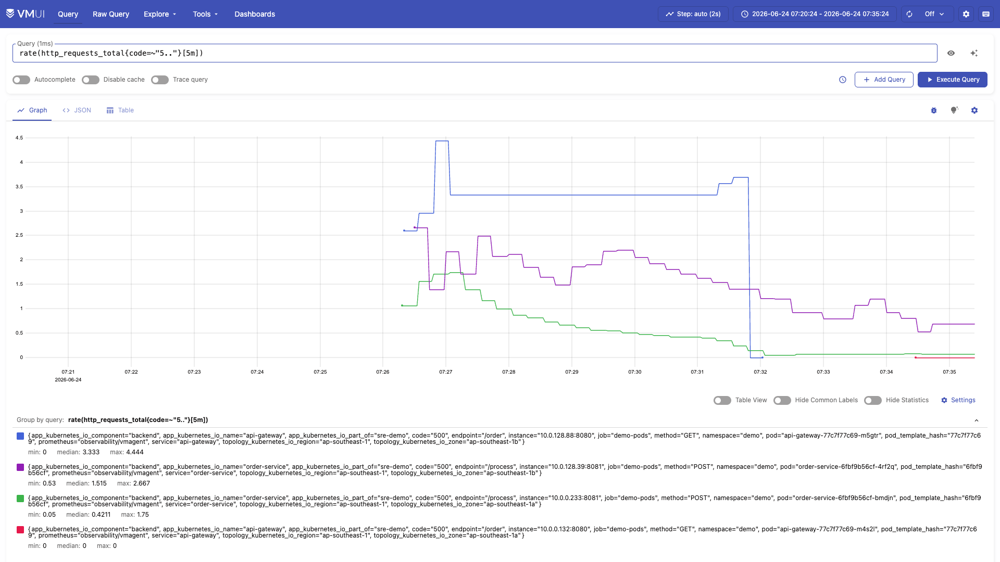
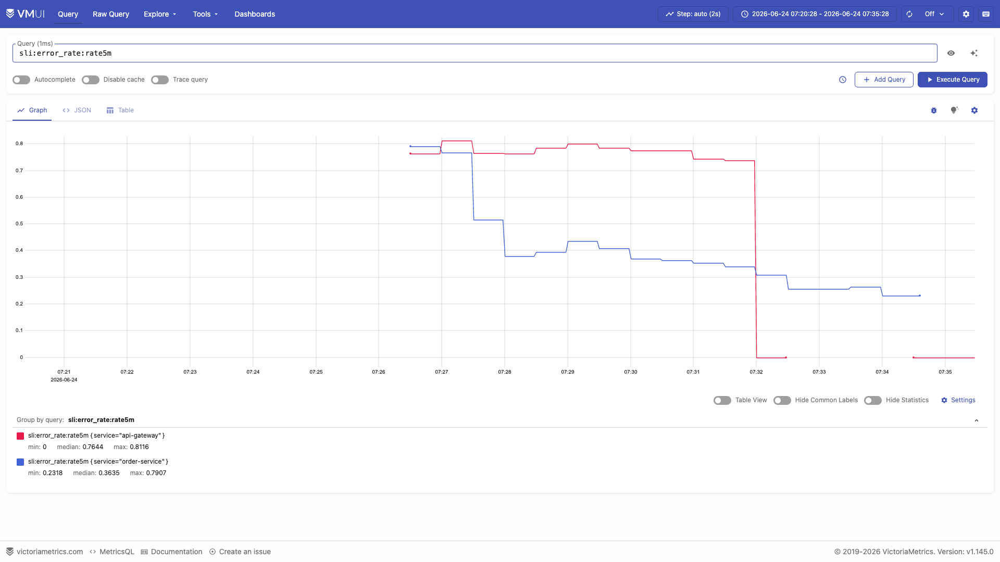
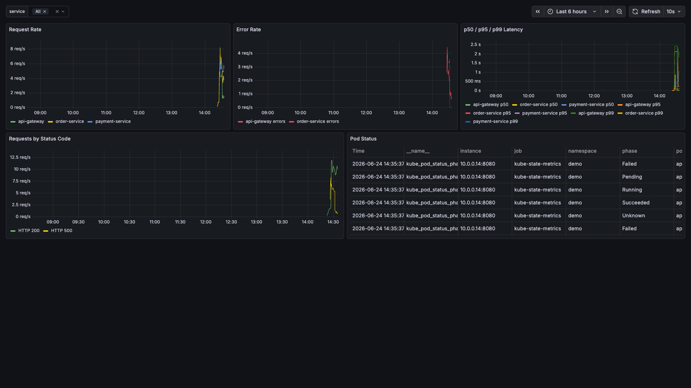
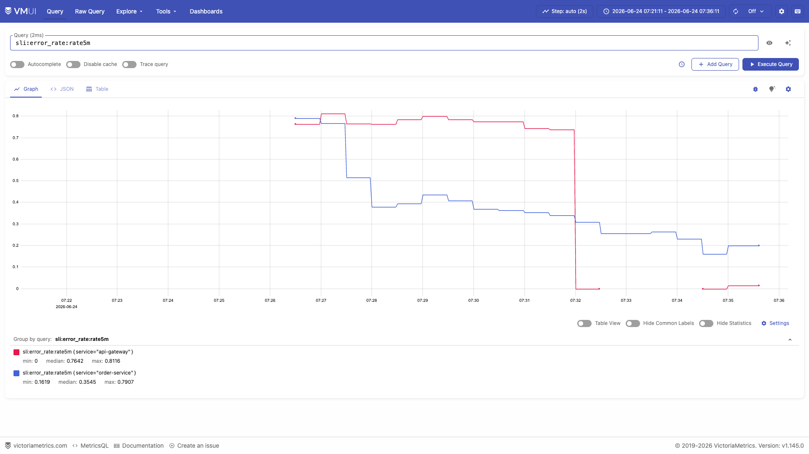

# Case 2: Error Rate Spike (L2 Escalation)

## What This Demonstrates

End-to-end detection and escalation of a sudden increase in HTTP 5xx errors. This scenario validates the availability SLO burn rate alerting pipeline -- from chaos-injected errors through VMAlert rule evaluation to MCP-driven L2 escalation. Like the latency case, error spikes require human investigation, so auto-remediation is deliberately excluded.

## Real-World Scenario

A service begins returning 500 Internal Server Error for a percentage of requests. In production, this commonly results from:
- A bad deployment introducing a regression
- An upstream API contract change breaking deserialization
- Database connectivity failures (transient or persistent)
- Resource exhaustion (OOM kills, file descriptor limits)
- Configuration drift (expired secrets, rotated credentials)

## Chaos Injection

The payment-service exposes a `/chaos/errors` endpoint that makes a configurable percentage of requests return HTTP 500:

```bash
# Via the chaos script (recommended -- runs inside the cluster)
./scripts/chaos/inject-errors.sh 30

# Or directly via kubectl exec
kubectl exec -n demo deploy/payment-service -- \
  curl -s -X POST http://localhost:8082/chaos/errors \
  -H "Content-Type: application/json" \
  -d '{"rate": 30}'
```

This sets `chaos_config["error_rate"] = 30`, causing 30% of `/pay` requests to short-circuit with a 500 response before touching the database. The randomization uses `random.randint(1, 100) <= 30` for uniform distribution.

## What Happens (Step by Step)

```
1. payment-service returns HTTP 500 for ~30% of /pay requests
   (logged as "Injected payment error" at ERROR level)

2. order-service receives 500s from payment-service, propagates errors upstream

3. api-gateway /order endpoint error rate rises
   http_requests_total{code="500"} counter increases alongside {code="200"}

4. Recording rules calculate error budget burn:
   sli:error_rate:rate5m = sum(rate(5xx)) / sum(rate(total)) ≈ 0.30
   sli:error_budget_burn:rate5m = 0.30 / 0.001 = 300x
   (SLO target is 99.5%, so error budget = 0.5% = 0.005, burn = 0.30/0.005 = 60x)

5. VMAlert evaluates SLOBurnRateCritical:
   sli:error_budget_burn:rate5m > 14.4 → TRUE (300x >> 14.4)
   sli:error_budget_burn:rate1h > 14.4 → TRUE (once 1h window accumulates data)
   Alert fires after 2 minutes sustained

6. VMAlertmanager routes alert to MCP server webhook (:8091/webhook)

7. MCP server webhook handler:
   - Receives alert with alertname="SLOBurnRateCritical"
   - Reads sre/runbooks/high-error-rate.md
   - Checks for "AUTO-REMEDIATION: ELIGIBLE" marker
   - Marker NOT found → returns {"level": "L2", "action": "escalated"}

8. Alert escalated for human SRE investigation
```

## Expected Observations

### VMSingle vmui Queries

Error rate by service:
```metricsql
sum(rate(http_requests_total{code=~"5.."}[5m])) by (service)
/
sum(rate(http_requests_total[5m])) by (service)
```
Expected result: payment-service shows ~0.30 (30% error rate).

Error breakdown by endpoint and status code:
```metricsql
sum(rate(http_requests_total{code=~"5.."}[5m])) by (service, endpoint, code)
```
Expected result: `/pay` endpoint shows 500 errors from payment-service.

SLO burn rate:
```metricsql
sli:error_budget_burn:rate5m
```
Expected result: far exceeds 14.4x threshold.

SLO availability:
```metricsql
sli:availability:rate5m
```
Expected result: drops from 1.0 to ~0.70 for payment-service.

### VMAlert

- `SLOBurnRateCritical` alert fires with severity=critical
- Annotation shows: "Service payment-service is burning error budget at 300.0x the allowed rate"

### Error Budget Impact

At 30% error rate with a 99.5% availability SLO (0.5% error budget over 30 days):
- **Burn rate**: 30% / 0.5% = 60x the allowed rate
- **Time to exhaust**: 30 days / 60 = 12 hours to consume the entire monthly error budget
- **Severity**: P1 Critical (burn rate > 14.4x)

## Why L2 (Not L1 Auto-Remediation)

The `sre/runbooks/high-error-rate.md` runbook is marked `AUTO-REMEDIATION: NOT ELIGIBLE (requires human judgment)`. The decision tree requires investigation:

| Possible Root Cause | Why Auto-Fix Is Unsafe |
|---------------------|-----------------------|
| Bad deployment | Rollback might work, but which service? Need to confirm the error source first. |
| Database migration failure | Rollback could cause schema inconsistency or data loss. |
| External dependency outage | Restart/rollback won't help -- need to contact the provider or enable fallback. |
| Resource exhaustion | Scaling might help, but need to understand why resources are exhausted. |
| Data corruption | Restarting could make things worse by re-processing corrupted data. |

The runbook provides a structured triage path:
1. Identify affected service via error rate MetricsQL query
2. Check error breakdown by endpoint and status code
3. Check recent deployments (`kubectl rollout history`)
4. Check pod health (`kubectl describe pod`)
5. Check application logs for error patterns (`kubectl logs`)

## Evidence Screenshots

**During injection** — 30% error rate visible across metrics:







**After resolution** — error rate returns to 0% after chaos reset:



## Reset

```bash
# Via chaos script
./scripts/chaos/inject-errors.sh 0

# Or directly
kubectl exec -n demo deploy/payment-service -- \
  curl -s -X POST http://localhost:8082/chaos/errors \
  -H "Content-Type: application/json" \
  -d '{"rate": 0}'

# Or reset all chaos at once
kubectl exec -n demo deploy/payment-service -- \
  curl -s -X DELETE http://localhost:8082/chaos
```

## Production Application

### Multi-Window Burn Rate Alerting

This demo implements the Google SRE Workbook's multi-window, multi-burn-rate alerting strategy:

| Alert | Burn Rate | Short Window | Long Window | Budget Exhaustion |
|-------|-----------|-------------|-------------|-------------------|
| `SLOBurnRateCritical` | > 14.4x | 5m | 1h | ~2 days |
| `SLOBurnRateWarning` | > 6x | 30m | 6h | ~5 days |

The dual-window requirement (short AND long must exceed threshold) prevents false positives:
- A 1-minute spike of 100% errors fires the 5m window but NOT the 1h window -- no page.
- Sustained 30% errors fire both windows -- page the on-call SRE.

### Integration Points

In production, error rate alerts feed into:
- **Deployment pipelines**: Auto-correlate error spikes with recent releases (Argo Rollouts, Flagger)
- **Feature flags**: Auto-disable features that correlate with error increases
- **Incident management**: Create PagerDuty/Opsgenie incidents with runbook links
- **Error tracking**: Sentry/Datadog APM for stack trace grouping and root cause analysis
- **Status pages**: Automatically update public status page when SLO is breached
