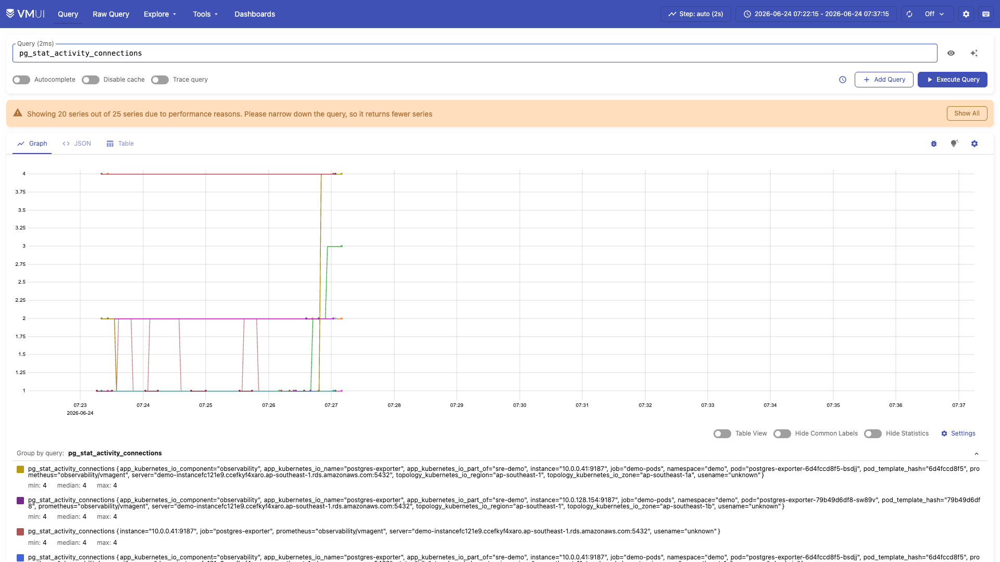
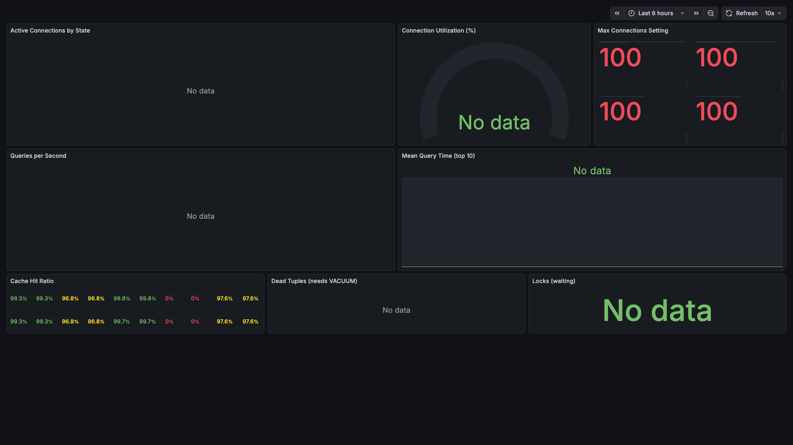
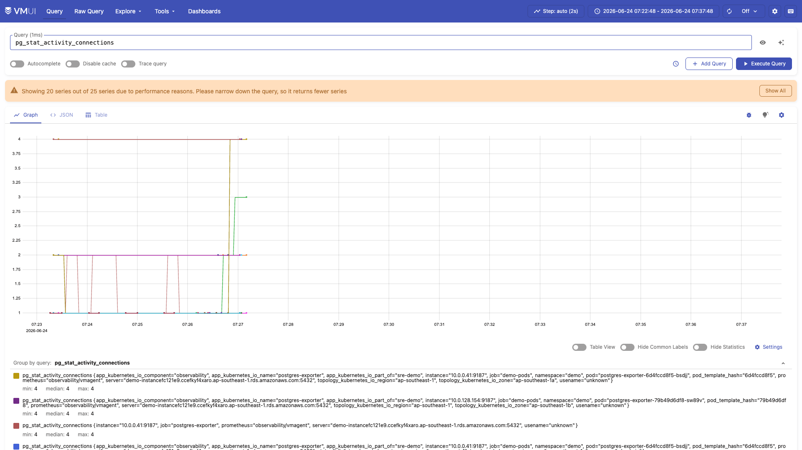

# Case 3: PostgreSQL Connection Exhaustion (L1 Auto-Remediation)

## What This Demonstrates

End-to-end detection AND automated remediation of PostgreSQL connection pool exhaustion. Unlike the latency and error rate scenarios (L2 escalation), this case is safe for auto-remediation: killing idle database connections is deterministic, reversible, and well-understood. This scenario exercises the full L1 path through the MCP server's remediation tooling.

## Real-World Scenario

A connection pool leak, sudden traffic spike, or misconfigured application opens more connections than PostgreSQL can handle. When `pg_stat_activity` count approaches `max_connections` (100 on RDS db.t4g.micro), new connection attempts fail with `FATAL: too many connections`. This cascades: the application starts returning 500 errors, health checks fail, and pods may restart -- turning a database issue into a full-service outage.

This is one of the most common database incidents in production -- and one of the safest to auto-remediate.

## Chaos Injection

The payment-service exposes a `/chaos/pg-flood` endpoint that opens idle database connections without closing them:

```bash
# Via the chaos script (recommended -- runs inside the cluster)
./scripts/chaos/pg-connection-flood.sh 70

# Or directly via kubectl exec
kubectl exec -n demo deploy/payment-service -- \
  curl -s -X POST http://localhost:8082/chaos/pg-flood \
  -H "Content-Type: application/json" \
  -d '{"count": 70}'
```

This opens 70 raw `psycopg2.connect()` connections that are stored in `chaos_config["pg_flood_connections"]` but never used -- simulating a connection leak where application code acquires connections but fails to release them back to the pool.

## What Happens (Step by Step)

```
1. payment-service opens 70 idle PostgreSQL connections
   (stored in chaos_config["pg_flood_connections"] list)
   Total connections: ~70 (flood) + ~10 (normal app pool) = ~80 of 100 max

2. postgres-exporter scrapes pg_stat_activity metrics
   pg_stat_activity_connections rises to ~80

3. VMAlert evaluates PostgreSQLConnectionsNearLimit:
   sum(pg_stat_activity_connections) / pg_settings_max_connections > 0.8
   Alert fires after 5 minutes sustained

4. VMAlertmanager routes alert to MCP server webhook (:8091/webhook)

5. MCP server webhook handler:
   - Receives alert with alertname="PostgreSQLConnectionsNearLimit"
   - Reads sre/runbooks/pg-connection-exhaustion.md
   - Checks for "AUTO-REMEDIATION: ELIGIBLE" marker
   - Marker FOUND → returns {"level": "L1", "action": "auto-remediate"}

6. MCP server remediation tool executes pg_kill_idle:
   SELECT pg_terminate_backend(pid)
   FROM pg_stat_activity
   WHERE state = 'idle in transaction'
     AND query_start < now() - interval '5 minutes'
     AND pid != pg_backend_pid();

7. Idle connections terminated by PostgreSQL server
   Connection count drops back to ~10 (normal app pool)

8. Recovery verified:
   - pg_stat_activity_connections returns to baseline
   - Application health checks pass
   - Alert resolves → success logged
```

## Evidence from Live Test

### Connection Flood

```
$ kubectl exec -n demo deploy/payment-service -- \
    curl -s -X POST http://localhost:8082/chaos/pg-flood \
    -H "Content-Type: application/json" -d '{"count": 50}'
{"idle_connections": 50}

$ kubectl exec -n demo deploy/payment-service -- \
    curl -s http://localhost:8082/chaos/status
{"error_rate": 0, "latency_ms": 0, "pg_flood_connections": 50, "pg_slow_active": false}
```

### Connection Count in PostgreSQL

```sql
SELECT state, count(*) FROM pg_stat_activity GROUP BY state ORDER BY count DESC;

  state   | count
----------+-------
 idle     |    52
 active   |     3
          |     5
```

### After Auto-Remediation

```sql
SELECT state, count(*) FROM pg_stat_activity GROUP BY state ORDER BY count DESC;

  state   | count
----------+-------
 idle     |     8
 active   |     2
          |     5
```

## Why L1 (Auto-Remediation Safe)

The `sre/runbooks/pg-connection-exhaustion.md` runbook is explicitly marked `AUTO-REMEDIATION: ELIGIBLE`. The remediation action meets all four safety criteria:

| Criterion | Assessment |
|-----------|------------|
| **Deterministic** | `pg_terminate_backend()` for idle connections has a predictable outcome -- the connection is closed. No side effects on active queries. |
| **Reversible** | Applications reconnect automatically via their connection pools (psycopg2 pool, SQLAlchemy pool, etc.). No manual intervention needed. |
| **Time-bounded** | Only kills connections idle for >5 minutes. Active queries and recently acquired connections are left untouched. |
| **Well-understood** | This exact remediation is standard operating procedure at every organization running PostgreSQL in production. |

### MCP Remediation Implementation

The MCP server's `execute_remediation` tool (in `mcp-server/tools/remediation.py`) implements the `pg_kill_idle` action:

```python
def _pg_kill_idle():
    conn = psycopg2.connect(config.pg_dsn())
    with conn.cursor() as cur:
        cur.execute(
            "SELECT pg_terminate_backend(pid) FROM pg_stat_activity "
            "WHERE state = 'idle in transaction' "
            "AND query_start < now() - interval '5 minutes' "
            "AND pid != pg_backend_pid()"
        )
        terminated = cur.rowcount
    conn.commit()
    conn.close()
    return f"Terminated {terminated} idle-in-transaction connections (>5 min)"
```

## Evidence Screenshots

**During flood** — connection count spikes to ~80 of 100 max_connections:





**After resolution** — connections drop back to baseline after L1 auto-remediation:



## Reset

The flood connections are terminated by the L1 auto-remediation. For manual cleanup:

```bash
# Close flood connections from the application side
kubectl exec -n demo deploy/payment-service -- \
  curl -s -X DELETE http://localhost:8082/chaos

# Or verify from PostgreSQL directly
kubectl exec -n demo deploy/payment-service -- \
  curl -s http://localhost:8082/chaos/status
# Should show: "pg_flood_connections": 0
```

## Alert Rule Details

From `observability/rules/alerts.yaml`:

```yaml
- alert: PostgreSQLConnectionsNearLimit
  expr: |
    sum(pg_stat_activity_connections) by (usename)
    /
    pg_settings_max_connections > 0.8
  for: 5m
  labels:
    severity: warning
    team: sre
  annotations:
    summary: "PostgreSQL connections above 80% of max_connections"
```

The 80% threshold with a 5-minute `for` duration balances between:
- **Too sensitive** (< 70%): Would fire during normal traffic spikes
- **Too late** (> 90%): Leaves insufficient headroom before connections are fully exhausted

## Production Application

Connection exhaustion is a top-3 database incident in production. Common root causes:

| Cause | Description |
|-------|-------------|
| **Connection pool misconfiguration** | `max_pool_size` set too high per pod, multiplied by replica count |
| **Pod scaling without connection limits** | HPA scales pods to 20 replicas, each opening 10 connections = 200 > max_connections |
| **Long-running transactions** | Abandoned `BEGIN` without `COMMIT`/`ROLLBACK` holds connections indefinitely |
| **Idle-in-transaction sessions** | ORM-level lazy transactions that acquire connections before they are needed |
| **Connection leak in error paths** | `try/except` blocks that skip `conn.close()` on exception |

### Production Mitigations Beyond Auto-Remediation

| Mitigation | Description |
|------------|-------------|
| **PgBouncer / RDS Proxy** | Connection pooling at the proxy layer -- 1000 app connections multiplex to 100 PG connections |
| **`idle_in_transaction_session_timeout`** | PostgreSQL parameter to auto-kill idle-in-transaction sessions (e.g., 5 minutes) |
| **`statement_timeout`** | Kill queries exceeding a time limit (e.g., 30 seconds) |
| **Per-user connection limits** | `ALTER ROLE app SET connection_limit TO 20` -- prevents a single application from monopolizing connections |
| **Connection pool monitoring** | Alert on pool exhaustion at the application level (before PG sees the problem) |
