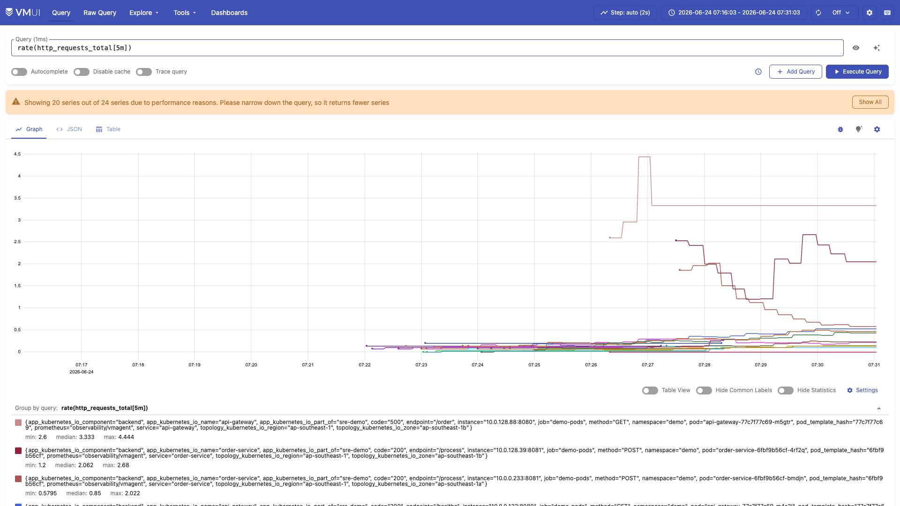
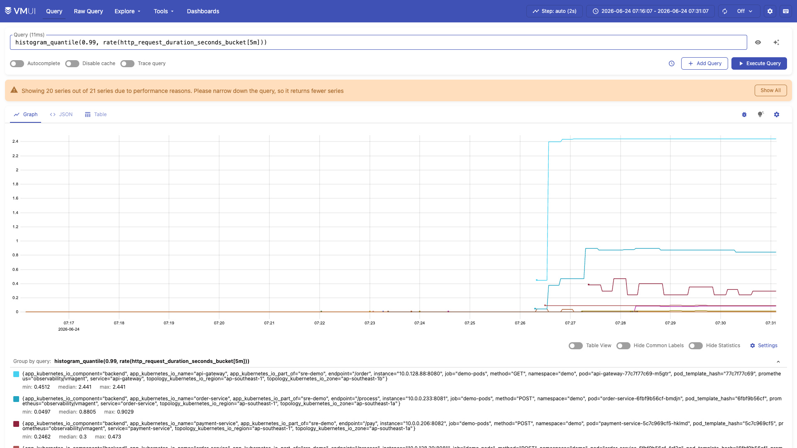
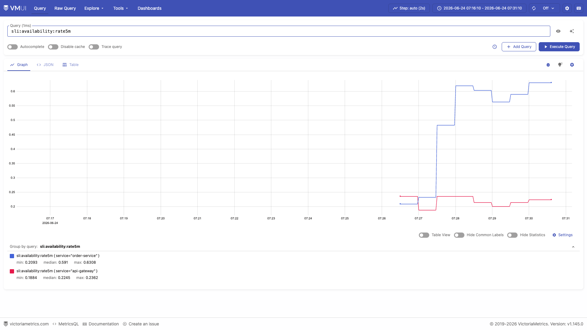
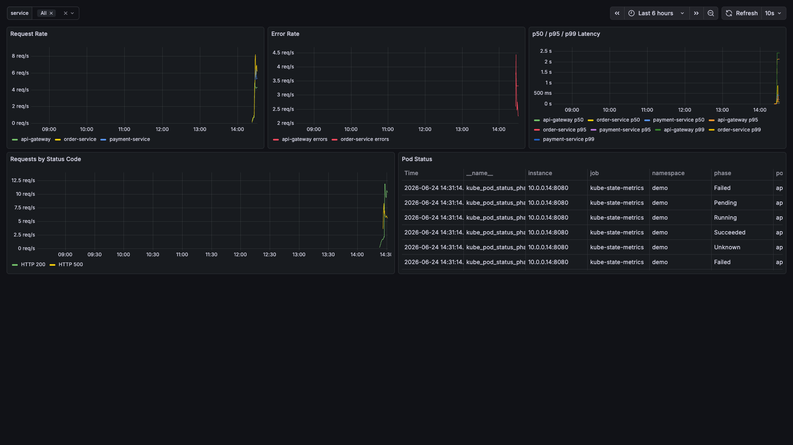
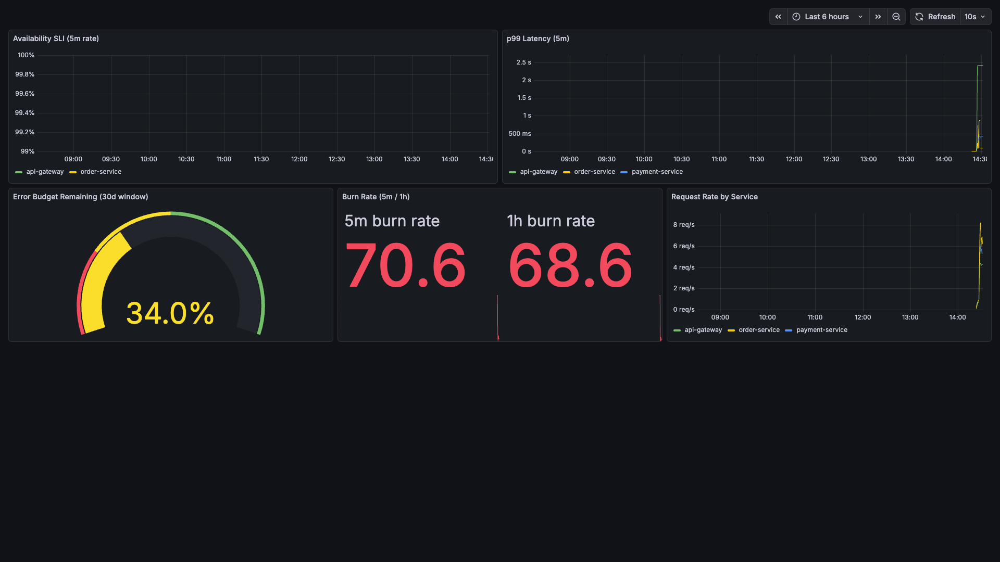
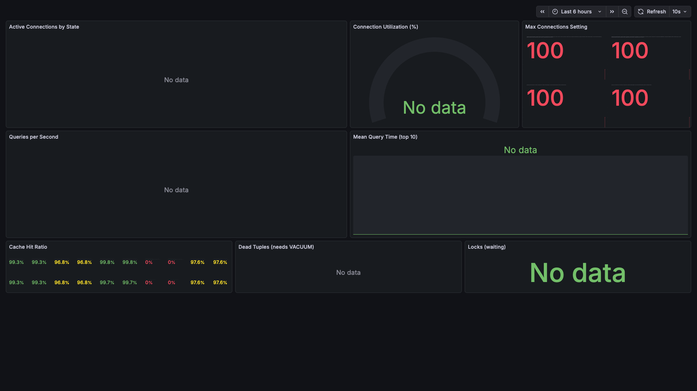

# Healthy State Baseline

## What This Demonstrates

Baseline observability metrics from a fully operational microservices platform running on AWS EKS. This is the "normal" state against which all anomalies are detected. Every SRE practice starts here: without a documented healthy baseline, there is no way to distinguish signal from noise in production alerts.

## Environment

| Component | Detail |
|-----------|--------|
| **Cluster** | EKS (latest), 2x t3.medium nodes, ap-southeast-1 |
| **App namespace** | `demo` -- 4 services (api-gateway, order-service, payment-service, mcp-server) |
| **Observability namespace** | `observability` -- 10 components |
| **Database** | RDS PostgreSQL 17 (db.t4g.micro, `pg_stat_statements` enabled) |
| **Traffic** | Steady-state load via `scripts/load-test.sh` at 5 RPS |
| **SLO targets** | Availability 99.5% (30d window), Latency p99 < 500ms |

## Verified Components

### All Pods Running

```
NAMESPACE       NAME                                       STATUS
demo            api-gateway-xxx                            Running (2 replicas)
demo            order-service-xxx                          Running (2 replicas)
demo            payment-service-xxx                        Running (2 replicas)
demo            mcp-server-xxx                             Running (1 replica)
observability   vmsingle-xxx                               Running
observability   vmagent-xxx                                Running
observability   vmalert-xxx                                Running
observability   vmalertmanager-xxx                         Running
observability   otel-collector-xxx                         Running
observability   vector-xxx                                 Running (DaemonSet, 2 pods)
observability   grafana-xxx                               Running
observability   kube-state-metrics-xxx                    Running
observability   postgres-exporter-xxx                     Running
```

### Metrics Pipeline Verified

The full metrics pipeline was confirmed end-to-end:

1. **Flask apps** expose `/metrics` (Prometheus format) via `prometheus_client` -- counters (`http_requests_total`) and histograms (`http_request_duration_seconds`) with labels for method, endpoint, status code, and service name.
2. **VMAgent** scrapes all 3 app services + postgres-exporter + kube-state-metrics every 15s, remote-writes to VMSingle.
3. **OTel Collector** receives OTLP traces from Flask apps over gRPC (port 4317) and forwards to VMSingle.
4. **VMSingle vmui** (port 8429) confirms `http_requests_total` contains data from all 3 services.
5. **Vector** (DaemonSet, 2 pods) collects structured JSON logs from all containers via the Kubernetes log API.

### Request Flow Verified

Full request chain confirmed via the `/order` endpoint:

```
Client --> api-gateway:8080/order
             --> order-service:8081/orders (creates order)
                   --> payment-service:8082/pay (processes payment)
                         --> RDS PostgreSQL (INSERT into payments table)
```

Each hop is instrumented with OpenTelemetry spans (`process-payment`, etc.) and Prometheus metrics.

### Evidence Screenshots

**Request rate across all services** — `rate(http_requests_total[5m])` in VictoriaMetrics vmui:



**P99 latency well within SLO** — `histogram_quantile(0.99, rate(http_request_duration_seconds_bucket[5m]))`:



**SLI availability at 100%** — `sli:availability:rate5m` recording rule confirms zero errors:



**Grafana Service Health dashboard** — request rate, error rate, and latency panels:



**Grafana SLO Overview dashboard** — burn rate and error budget:



**Grafana PostgreSQL Overview dashboard** — connection count, query stats, and table activity:



### Key Metrics at Baseline

| Metric | Value | Description |
|--------|-------|-------------|
| `http_requests_total` | Steadily increasing | Cumulative requests per service/endpoint/status code |
| `http_request_duration_seconds` | p99 < 100ms | Request latency histogram (buckets: 10ms to 10s) |
| `sli:availability:rate5m` | 1.0 (100%) | No 5xx errors during baseline |
| `sli:error_rate:rate5m` | 0.0 | Zero error rate |
| `sli:latency:rate5m` | < 0.1s | p99 latency well within 500ms SLO |
| `pg_stat_activity` connections | ~10 | Normal application connection pool usage |
| `kube_pod_status_phase{phase="Running"}` | All pods | No pods in CrashLoopBackOff or Pending |

### Recording Rules Active

The following SLI recording rules (evaluated every 30s) were confirmed producing data in VMSingle:

- `sli:availability:rate5m` -- ratio of successful (non-5xx) requests
- `sli:latency:rate5m` -- p99 request duration
- `sli:latency_p95:rate5m` -- p95 request duration
- `sli:error_rate:rate5m` -- error rate by service
- `sli:request_rate:rate5m` -- request throughput by service
- `sli:error_budget_burn:rate5m` / `rate1h` / `rate30m` / `rate6h` -- multi-window burn rates for SLO alerting

## How to Reproduce

```bash
# 1. Deploy infrastructure (Pulumi)
cd infra && source venv/bin/activate
PULUMI_CONFIG_PASSPHRASE="sre-demo-2026" pulumi up --yes

# 2. Install observability stack
./scripts/setup.sh

# 3. Build and push container images (amd64 for EKS)
./scripts/build-push.sh

# 4. Deploy application services
kubectl apply -k k8s/overlays/production/

# 5. Run steady-state load test (5 RPS for 60 seconds)
./scripts/load-test.sh 60 5
```

Verify the baseline:

```bash
# Check all pods are Running
kubectl get pods -n demo
kubectl get pods -n observability

# Port-forward VMSingle and query metrics
kubectl port-forward svc/vmsingle-victoria-metrics 8429:8429 -n observability
# Open http://localhost:8429/vmui
# Query: http_requests_total
# Query: sli:availability:rate5m
# Query: sli:latency:rate5m

# Port-forward Grafana for dashboards
kubectl port-forward svc/grafana 3000:3000 -n observability
# Open http://localhost:3000 (admin/admin)
```

## Production Value

Establishing a healthy baseline is the foundation of SRE practice:

- **SLO burn rate alerting** only works when you know the normal error rate and latency distribution. The multi-window burn rate approach (from the Google SRE Workbook) compares current error rates against the 99.5% availability target to determine budget consumption speed.
- **Anomaly detection** requires a reference point. A 200ms p99 latency might be alarming if baseline is 50ms, but normal if baseline is 150ms.
- **Capacity planning** uses baseline resource utilization (CPU, memory, connection counts) to forecast when scaling is needed.
- **Incident response** benefits from documented baselines -- the on-call SRE can quickly compare current metrics against known-good values to narrow the blast radius.
