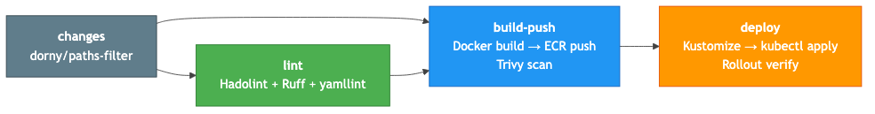

# CI/CD Setup Guide

## Overview

This project uses GitHub Actions with AWS OIDC federation for keyless CI/CD. The pipeline has 4 jobs: changes detection, lint, build-push, and deploy.

No long-lived AWS credentials are stored in GitHub. The workflow authenticates using OpenID Connect (OIDC), which issues short-lived temporary credentials for each run.

## Prerequisites

- AWS account with sufficient permissions (IAM, EKS, ECR, STS)
- GitHub repository: `pLuanVo/sre-eks-observability-demo`
- Pulumi infrastructure deployed (`pulumi up` completed successfully)
- AWS CLI v2 and `kubectl` configured locally
- GitHub CLI (`gh`) installed for secret management

## Pipeline Architecture



### Job Details

- **changes**: Uses `dorny/paths-filter@v3` to detect which paths changed (`apps/`, `infra/`, `k8s/`, `observability/`, `mcp-server/`). Downstream jobs use these outputs to skip unnecessary work.
- **lint**: Runs three linters in sequence:
  - **Hadolint** (`hadolint-action@v3.1.0`) on all four Dockerfiles (`apps/api-gateway`, `apps/order-service`, `apps/payment-service`, `mcp-server`)
  - **Ruff** for Python code in `apps/` and `mcp-server/`
  - **yamllint** (relaxed profile) on `k8s/`, `observability/`, and `sre/`
- **build-push**: Runs only on push to `main` when app code changed. Builds Docker images for all 4 services, pushes to ECR, then runs Trivy vulnerability scan (CRITICAL + HIGH severity, pipeline fails on findings).
- **deploy**: Runs on push to `main` when either K8s manifests changed or build-push succeeded. Updates Kustomize image tags via `sed`, applies the production overlay, and verifies rollout status for all deployments.

## How OIDC Federation Works

Traditional CI/CD stores long-lived AWS access keys as GitHub secrets. OIDC federation eliminates this:

1. **GitHub generates a JWT token** for each workflow run. This happens automatically when the workflow has `permissions: id-token: write`.
2. **The JWT contains claims** identifying the run: repository (`pLuanVo/sre-eks-observability-demo`), branch, workflow name, and actor.
3. **AWS IAM OIDC provider** validates the JWT signature against GitHub's public keys. The provider was created by Pulumi in `infra/components/iam_github.py`.
4. **AWS STS issues temporary credentials** via `AssumeRoleWithWebIdentity`. These credentials expire after the session (typically 1 hour).
5. **No long-lived AWS credentials are stored in GitHub** -- only the IAM role ARN is needed as a secret. The role ARN itself is not sensitive (it cannot be used without a valid GitHub JWT).

**Benefits**:
- No secret rotation needed -- credentials are ephemeral
- No credential leaks possible -- there are no credentials to leak
- Full audit trail via AWS CloudTrail (each `AssumeRoleWithWebIdentity` call is logged)
- Blast radius limited to the specific repository via trust policy conditions

## Setup Steps

### Step 1: Deploy Infrastructure

The Pulumi stack creates all AWS resources including the OIDC provider, IAM role, EKS cluster, ECR repositories, and the EKS access entry that grants the CI role cluster-admin permissions.

```bash
cd infra
source venv/bin/activate
PULUMI_CONFIG_PASSPHRASE="sre-demo-2026" pulumi up --yes
```

This creates:
- IAM OIDC provider for `token.actions.githubusercontent.com`
- IAM role `ci-role-*` with ECR push and EKS access policies
- EKS access entry + `AmazonEKSClusterAdminPolicy` association for the role
- ECR repositories under `sre-demo/` prefix
- VPC, EKS cluster, RDS instance, and node group

### Step 2: Get the Role ARN

After `pulumi up` completes, retrieve the GitHub Actions role ARN:

```bash
PULUMI_CONFIG_PASSPHRASE="sre-demo-2026" pulumi stack output github_actions_role_arn
```

Example output:
```
arn:aws:iam::123456789012:role/ci-role-a1b2c3d
```

### Step 3: Set GitHub Repository Secret

Store the role ARN as a GitHub Actions secret. This is the **only** secret the pipeline needs.

Using GitHub CLI:
```bash
gh secret set AWS_DEPLOY_ROLE_ARN --body "arn:aws:iam::123456789012:role/ci-role-a1b2c3d"
```

Or via GitHub UI:
1. Go to the repository on GitHub
2. Navigate to **Settings** > **Secrets and variables** > **Actions**
3. Click **New repository secret**
4. Name: `AWS_DEPLOY_ROLE_ARN`
5. Value: paste the role ARN from Step 2
6. Click **Add secret**

### Step 4: Verify CI Pipeline

Push a commit to `main` to trigger the full pipeline:

```bash
git add -A
git commit -m "ci: trigger pipeline verification"
git push origin main
```

Monitor the workflow run:
```bash
gh run watch
```

Or list recent runs:
```bash
gh run list --limit 5
```

### Step 5: Verify All Stages

Check each job in the workflow run:

**lint** (no AWS credentials needed):
```bash
gh run view --log --job <lint-job-id>
```
- Should pass immediately. Failures here indicate Dockerfile, Python, or YAML linting issues.
- Fix locally with: `hadolint apps/*/Dockerfile`, `ruff check apps/ mcp-server/`, `yamllint -d relaxed k8s/ observability/ sre/`

**build-push** (authenticates via OIDC):
```bash
gh run view --log --job <build-push-job-id>
```
- Look for "Successfully configured credentials" from `aws-actions/configure-aws-credentials@v4`
- Look for "Login Succeeded" from `aws-actions/amazon-ecr-login@v2`
- All 4 images should build and push: `api-gateway`, `order-service`, `payment-service`, `mcp-server`
- Trivy scan runs on all 4 images (blocks pipeline on CRITICAL/HIGH findings)

**deploy** (authenticates via OIDC):
```bash
gh run view --log --job <deploy-job-id>
```
- Kubeconfig should update for cluster `sre-demo` in `ap-southeast-1`
- Kustomize image tags should be replaced (no more `REPLACE_WITH_TAG` or `ACCOUNT_ID` placeholders)
- All 4 deployments should report successful rollout within 120s timeout

## IAM Role Permissions

The GitHub Actions role (created by `infra/components/iam_github.py`) has the following permissions:

| Permission | Type | Purpose |
|------------|------|---------|
| `AmazonEC2ContainerRegistryPowerUser` | AWS Managed Policy | Push and pull Docker images to/from ECR |
| `AmazonEKSClusterPolicy` | AWS Managed Policy | EKS cluster operations |
| `eks:DescribeCluster` | Inline Policy | Generate kubeconfig via `aws eks update-kubeconfig` |
| `eks:ListClusters` | Inline Policy | List available EKS clusters |
| EKS Access Entry (ClusterAdmin) | EKS Access Policy | Full kubectl access to the Kubernetes API |

The EKS access entry is created as a `STANDARD` type entry with `AmazonEKSClusterAdminPolicy` at cluster scope, granting full Kubernetes API access.

## Trust Policy

The IAM role's trust policy restricts assumption to:
- Only GitHub Actions OIDC tokens (audience: `sts.amazonaws.com`)
- Only this specific GitHub repository (`pLuanVo/sre-eks-observability-demo`)
- Any branch, tag, or environment within the repository (the `sub` claim uses `StringLike` with wildcard)

```json
{
  "Version": "2012-10-17",
  "Statement": [
    {
      "Effect": "Allow",
      "Principal": {
        "Federated": "arn:aws:iam::123456789012:oidc-provider/token.actions.githubusercontent.com"
      },
      "Action": "sts:AssumeRoleWithWebIdentity",
      "Condition": {
        "StringEquals": {
          "token.actions.githubusercontent.com:aud": "sts.amazonaws.com"
        },
        "StringLike": {
          "token.actions.githubusercontent.com:sub": "repo:pLuanVo/sre-eks-observability-demo:*"
        }
      }
    }
  ]
}
```

The OIDC provider thumbprint is set to `ffffffffffffffffffffffffffffffffffffffff`. GitHub Actions uses intermediate CAs signed by a root CA that AWS trusts, so the thumbprint is not validated in practice (AWS announced this in July 2023). The all-f thumbprint is a common convention.

## Triggering the Pipeline

| Trigger | What Runs |
|---------|-----------|
| Push to `main` | All 4 jobs. `build-push` only if `apps/` or `mcp-server/` changed. `deploy` only if `k8s/`/`observability/` changed OR `build-push` succeeded. |
| Pull request to `main` | `changes` + `lint` only. `build-push` and `deploy` are skipped (guarded by `github.event_name == 'push'`). |
| Manual dispatch (`workflow_dispatch`) | All 4 jobs, same conditional logic as push. |

**Paths ignored on push**: `docs/**` and `**.md` and `.mcp.json` -- changes to these files do not trigger the pipeline at all.

## Workflow File Reference

The pipeline is defined in `.github/workflows/ci.yml`. Key configuration:

```yaml
permissions:
  id-token: write    # Required for OIDC token generation
  contents: read     # Required for actions/checkout

env:
  AWS_REGION: ap-southeast-1
```

The `id-token: write` permission is critical. Without it, the `aws-actions/configure-aws-credentials` action cannot request an OIDC token from GitHub, and the build-push and deploy jobs will fail with credential errors.

The EKS cluster name is stored as a separate GitHub secret (`EKS_CLUSTER_NAME`) rather than hardcoded, since Pulumi generates a unique suffix for the cluster name.

## Kustomize Image Tag Strategy

The production overlay (`k8s/overlays/production/kustomization.yaml`) uses placeholder values:

```yaml
images:
  - name: api-gateway
    newName: ACCOUNT_ID.dkr.ecr.REGION.amazonaws.com/sre-demo/api-gateway
    newTag: REPLACE_WITH_TAG
```

During the deploy job, `sed` replaces these placeholders with actual values:
- `ACCOUNT_ID.dkr.ecr.REGION.amazonaws.com` is replaced with the ECR registry URL from the build-push output
- `REPLACE_WITH_TAG` is replaced with the git commit SHA (`github.sha`)

This means the kustomization.yaml in the repository always contains placeholders. The actual image references are only resolved at deploy time.

## Local Development Workflow

For local iteration before pushing to CI:

```bash
# Lint (matches CI checks)
hadolint apps/api-gateway/Dockerfile
hadolint apps/order-service/Dockerfile
hadolint apps/payment-service/Dockerfile
hadolint mcp-server/Dockerfile
ruff check apps/ mcp-server/
yamllint -d relaxed k8s/ observability/ sre/

# Build images locally (note: use buildx for amd64 on Apple Silicon)
docker buildx build --platform linux/amd64 -t sre-demo/api-gateway:local apps/api-gateway/
docker buildx build --platform linux/amd64 -t sre-demo/order-service:local apps/order-service/
docker buildx build --platform linux/amd64 -t sre-demo/payment-service:local apps/payment-service/
docker buildx build --platform linux/amd64 -t sre-demo/mcp-server:local -f mcp-server/Dockerfile .

# Validate Kustomize output
kubectl kustomize k8s/overlays/production/
```

> **Important**: If developing on Apple Silicon (M1/M2/M3), always use `docker buildx build --platform linux/amd64` for images that will run on EKS (x86 nodes). The default `docker build` produces `arm64` images that will crash on `amd64` nodes with `exec format error`.
